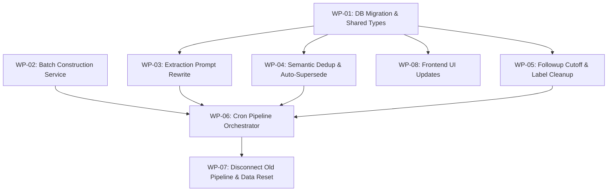

# FRF (Fact/Relation/Followup) Redesign Work Plan

> **For Claude:** Use `superpowers:dispatching-parallel-agents` to execute phases in parallel.
> Each WP file is a self-contained agent brief — dispatch one agent per WP within a phase.

**Goal:** Redesign the FRF extraction pipeline from per-message fire-and-forget to batched cron-based processing with expanded fact types, semantic deduplication, auto-supersede logic, and quality-focused prompt engineering.

**Architecture:** The new pipeline runs on a 30-minute cron schedule embedded in the backend server process. It queries unprocessed communications grouped by contact, splits them into overlapping batches, runs each batch through a rewritten Gemini Flash extraction prompt with structured JSON output, then persists results with embedding-based deduplication for facts and auto-supersede for singular fact types. The old per-message fire-and-forget extraction in `batch_upsert` is disconnected.

**Tech Stack:** Node.js/Express backend, PostgreSQL with pgvector, Google Generative AI SDK (`@google/generative-ai`), `text-embedding-004` for embeddings, `gemini-flash-latest` for extraction, Zod for validation, Next.js frontend with shadcn/ui, React Query for data fetching, Vitest for testing.

**Source Spec:** `SPEC-frf-redesign.md`

---

## Dependency Graph

## Execution Phases

| Phase | Work Packages | Run In Parallel | Gate |
|-------|--------------|-----------------|------|
| 1 | [WP-01](wp-01-db-migration-types.md), [WP-02](wp-02-batch-construction.md) | Yes | All Phase 1 WPs pass verification |
| 2 | [WP-03](wp-03-extraction-prompt.md), [WP-04](wp-04-semantic-dedup-supersede.md), [WP-05](wp-05-followup-cutoff-labels.md), [WP-08](wp-08-frontend-ui.md) | Yes | All Phase 2 WPs pass verification |
| 3 | [WP-06](wp-06-cron-pipeline.md) | N/A | WP-06 passes verification |
| 4 | [WP-07](wp-07-disconnect-old-pipeline.md) | N/A | All WPs pass verification |

## Summary

| WP | Name | Phase | Key Files | Complexity |
|----|------|-------|-----------|------------|
| 01 | DB Migration & Shared Types | 1 | `008_frf_redesign.sql`, `shared/types/fact.ts`, `backend/schemas/facts.ts`, `backend/config.ts` | Medium |
| 02 | Batch Construction Service | 1 | `backend/services/ai/batching.ts` (new) | Medium |
| 03 | Extraction Prompt Rewrite | 2 | `backend/services/ai/extraction.ts`, `backend/services/ai/gemini.ts` | Medium |
| 04 | Semantic Dedup & Auto-Supersede | 2 | `backend/services/ai/dedup.ts` (new), `backend/services/facts.ts` | High |
| 05 | Followup Cutoff & Label Cleanup | 2 | `backend/services/followups.ts`, `backend/schemas/relationships.ts` | Low |
| 06 | Cron Pipeline Orchestrator | 3 | `backend/jobs/frf-cron.ts` (new), `backend/services/ai/pipeline.ts`, `backend/index.ts` | High |
| 07 | Disconnect Old Pipeline & Data Reset | 4 | `backend/services/communications.ts`, `009_clear_extracted_frfs.sql` (new) | Low |
| 08 | Frontend UI Updates | 2 | `frontend/components/contact-detail/facts-section.tsx`, `frontend/components/contact-detail/relationships-section.tsx` | Medium |
